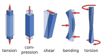
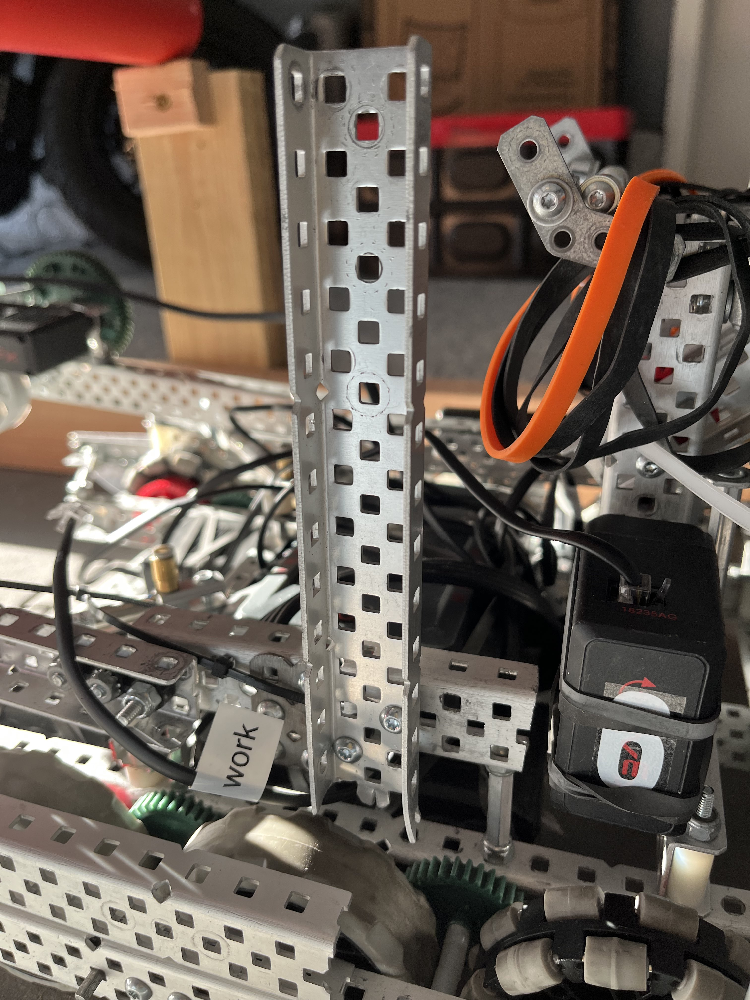

# Internal Forces (Stresses)

All physical objects can experience stresses as a result of external forces being applied on it. This also applies to a robot built for the VEX Robotics Competition. Robots can experience many different types of stresses, but the most common are:

- Bending
- Shear
- Torsion
- Compression/Tension

*MikeRun, [CC BY-SA 4.0](https://creativecommons.org/licenses/by-sa/4.0), via Wikimedia Commons*

## Bending

Bending is one of the most common types of stresses present in a VEX robot. It occurs when an object experiences a force perpendicular to its normal axis. Bending is very common in drivetrains, polycarbonate sheets, standoffs, and lifts.

## Torsion

Torsion is a more specific type of stress. It can occur when an object experiences a force tangent to its normal axis. It is very common to see torsion present in low strength shafts, bars, and other types of long objects with very little support. High torque applications exert more torsion and require special types of gears and axles to avoid damaging parts.

## Shear

Shearing is another very common stress. Shear stress occurs when an object experiences a force parallel to its cross section. Most robotics parts are able to withstand shear stress, but the connections that fix the part in place often cannot handle the torque. This can result in rotated or non-orthogonal structures. For example, a weak drivetrain without proper bracing when subjected to a shear force could form a rhombus shape that interferes with normal movement.

## Compression/Tension

This is the least common stress in robotics. Compression or tension can occur when an object experiences a force parallel to its normal axis. This stress is mostly present in fasteners such as screws and nuts and keeps the robot together. Over time, these forces can lead to shaft collars separating from their axles. Compression and tension forces are also present in lifts.

## Examples

In this image, can you spot each of the different forces that could act on potential mechanisms of this robot?

For the wing, shearing can occur and cause a torsional force on the outer drivetrain c-channel. Because the wing is also attached to the piston, a shearing force on the wing would cause a small tension force on the piston. In this case, the biggest issue would most likely be the torsional stress experienced by the drivetrain. This could cause additional friction on the axles, or even loosen the shaft collars.

The wheel guards are built with two angles and a line of connected standoffs. The standoffs could experience a bending force if they were hit in the middle. Additionally, this might cause a torsion force to be applied to the screws, which loosen them and cause the wheel guards to get caught in the omnidirectional wheel.

Finally, a bending force in the ramp could cause a tension force in the shaft collars, leading to a loose ramp. This could act as a wedge and prevent the robot from moving in the forwards or backwards direction.

These examples should make it clear how these different types of forces can act a robot and its mechanisms.

## Real World Examples

Which part of the robot in this photo is the weakest when subjected to a shear force?

If it was unclear from the image, the correct answer would be the vertical c-channel. This c-channel is designed to support a horizontal bar passive hang from Over Under. The function of this mechanism requires the robot to drive forward into the bar. This causes a shear force to be applied to the c-channel. Without any additional support, the torque force will overcome the compression force of the screw. To mitigate this, diagonal supports should be added to support the c-channel such as angles or bars. These have a much larger compression/tension force and will keep the structure rigid.

Analyzing mechanical structures requires a critical thought process. Every single aspect of the mechanism must be considered in all possible scenarios to determine whether it will be structurally sound. A three step process can be used to determine whether a mechanism can withstand potential stresses:

1. What functions does the structure have? Does it touch other parts of the robot?
    - If the part does touch other parts of the robot, further analysis is required.
2. What potential forces could be applied to the part? Does it have a range of motion? A simple test would be to operate the mechanism and see what moves; this would help determine where and how forces could be applied.
3. Each potential force should be nullified by an equal and opposite stress force (usually compression or tension). If a potential force is not counteracted by a stress force, the mechanism structure should be revised.

## Best Practices

- Triangle structures resist external forces much better than square structures.
  - A good rule of thumb is to make sure each structural member (i.e. c-channels) is always attached to two other structural members at different vertices.
- High torque applications require high torsional stiffness, in other words, use high strength shafts instead of low strength, and angles instead of bars. Always use the stronger variant.
- Properly brace structures; form triangles in your subsystems when ever possible.
