# Initial Research/Analysis
- Consists of the top 100 skills teams. Note that multiple different abbreviations are used in this table without consistency. Use search engines to understand their definitions wherever necessary.
- These are our personal opinions and judgements about the following robots and means no harm or criticism by this research.
- Completed on 12/22/23

##### Please use the scroll bar at the bottom of the table to see more information towards the right
---

|Ranking|Team|Drivetrain|Intake|Blocker|Launcher|Wings|Elevation|Notes|Picture|
|-------|----|----------|------|-------|--------|-----|---------|-----|-------|
|2|[87867D](https://youtu.be/cUIaSMqhPSE)|8 m, 4whl drive, mecanum whls|N/A|Puncher|2 bar with puncher|2 piston vertical wings|Puncher elevation|Uses a PTO for puncher and blocker|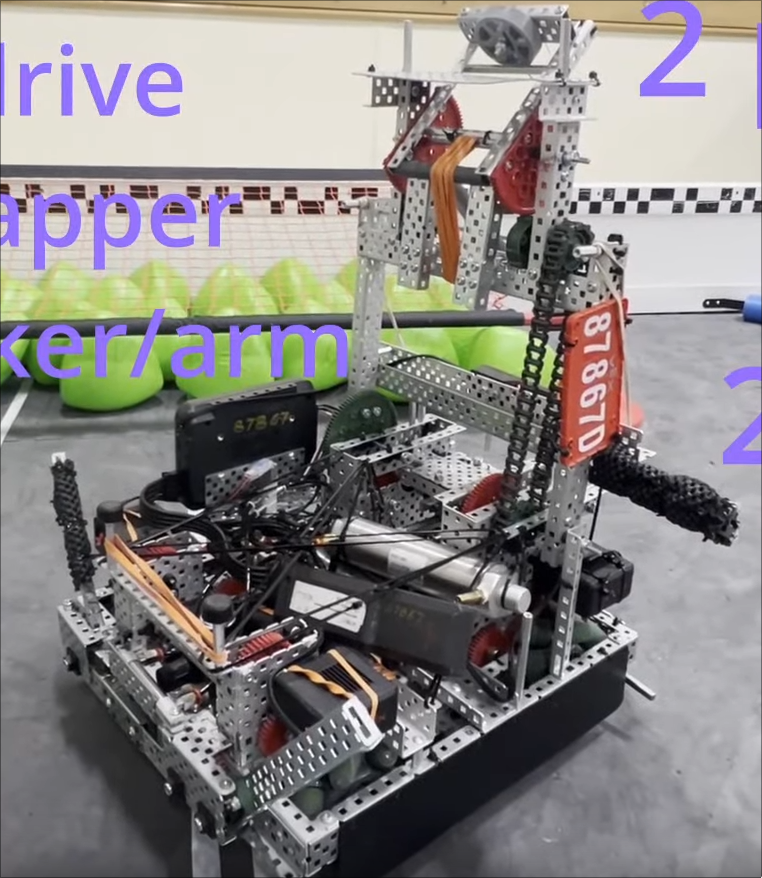|
|3|[229V](https://youtu.be/BGkmDeIMQyQ)|6m, 450rpm, 2.75in drive, 36:48 gear ratio|1m 600rpm Sprocket rubber bands|1 piston, 2 C-channels with poly|1m 33rpm Catapult with standoff puncher|2 piston horizontal wings|Passive elevation|Design seems a bit old||
|4|[2029C](https://youtu.be/tQ5A4HkNW5s)|6m, 450rpm, 2.75in drive|1m 600rpm roller intake|Launch Blocker|2m lift, 1m 40rpm double slip shooter|2p horizontal wings|Passive Elevation|Uses 2p PTO and gears for 4 bar lift||
|7|[2654P](https://youtu.be/_6kc8C9XtSk)|6m, 450rpm, 2.75in drive, 4whl|0.5m 400rpm roller intake|N/A|1m 100 shots per minute puncher; uses horizontal standoff|2 piston vertical wings|N/A|Incredibly consistent puncher!|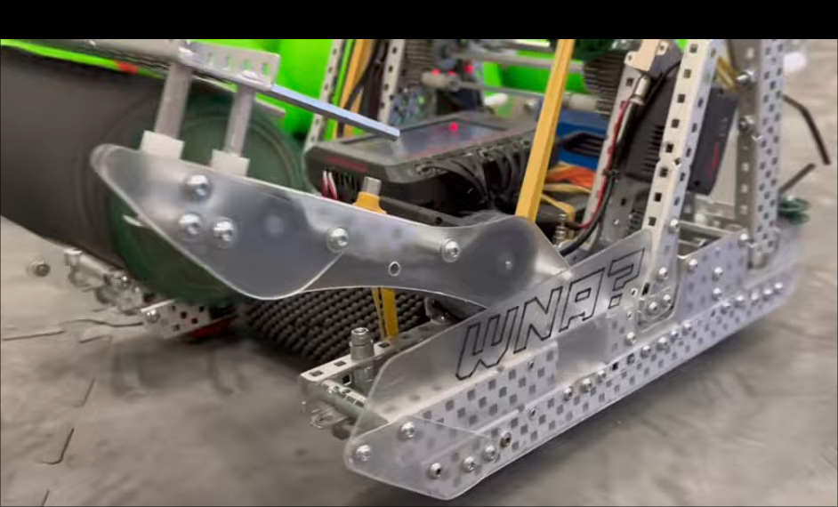|
|8|[66475C](https://youtu.be/R5K78sek7Sg)|300rpm, 4in whl, 6 whls|1m, Sprocket rubber band intake|Folding L-channel with string, piston activated|Catapult with standoff puncher|2 piston horizontal wings|N/A|Like our old bot but better||
|10|[2775V](https://youtu.be/2uI-MR7o6jU)|6m, 3.25in whls, 360rpm?|1m, Sprocket rubber band, Chain driven, motor in back|Launcher lift|2 piston 4 bar lift, half l-channels, Puncher ratio unknown|2 piston horizontal wings, not locking, bent polycarb|N/A|Really nice lift, odometry uses two tracking wheels|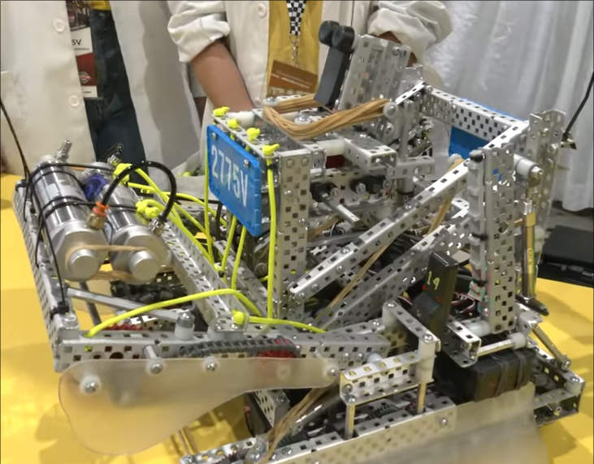|
|12|[48425A](https://youtu.be/h9_-mJn-qjI)|6m, 360rpm drive, 3.25in whls|1m, Dual sprockets rubber band|N/A|1m Catapult|2 piston horizontal wings, non-locking|Passive Catapult|This is our old robot!|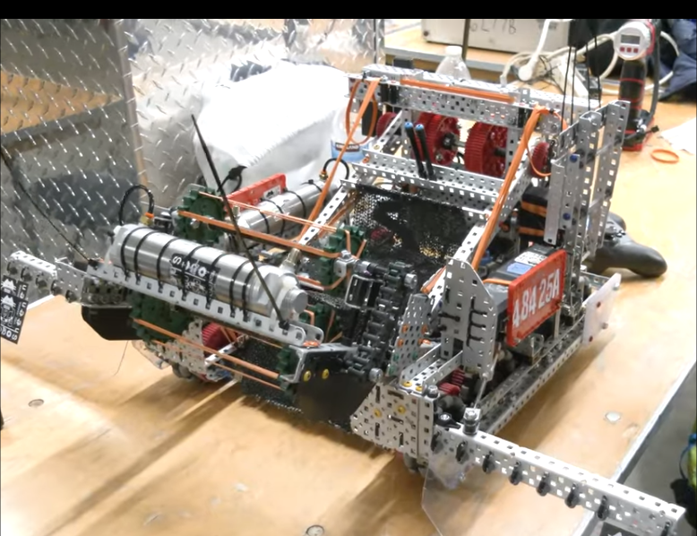|
|15|[323V](https://youtu.be/TzGvCIaibWk)|6m, 6 whl, 3.25in whls|1m, Roller intake|N/A|1m Catapult|2 piston locking wings|Passive Catapult|Carbon Copy. Also pretty old|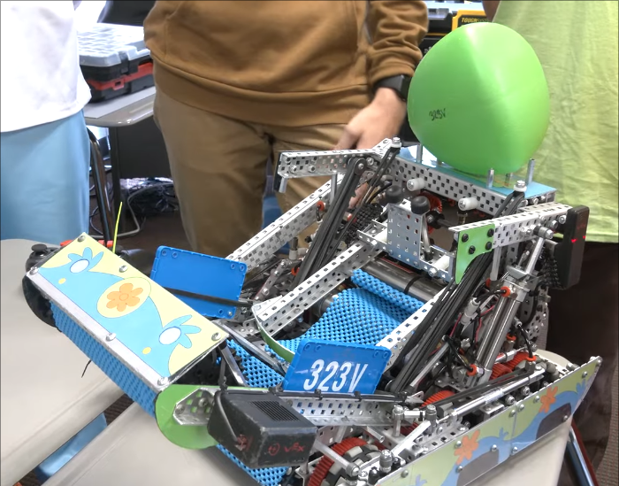|
|18|[99904B](https://youtu.be/ZNo4IFjghxU)|6m, 6 whl, 3.25in whls|N/A|Passive String Blocker|2m Puncher|2 piston locking wings|4 piston hang, B tier|Puncher is powered by PTO/Puncher between hang mech|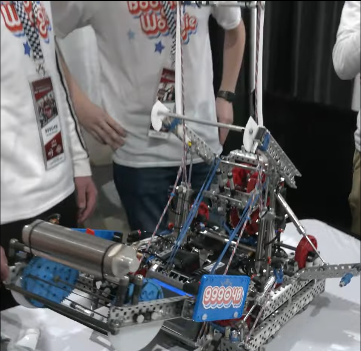|
|21|[8889A](https://youtu.be/PnQzdq1Jfc4)|6m, 300rpm, 6 whl, 4in whl|2 0.5m flexwhl intake|1 piston, 2 C-channel with poly|1m Cata/Puncher|2 piston wings|4 piston hang, B tier|Seems like a solid bot|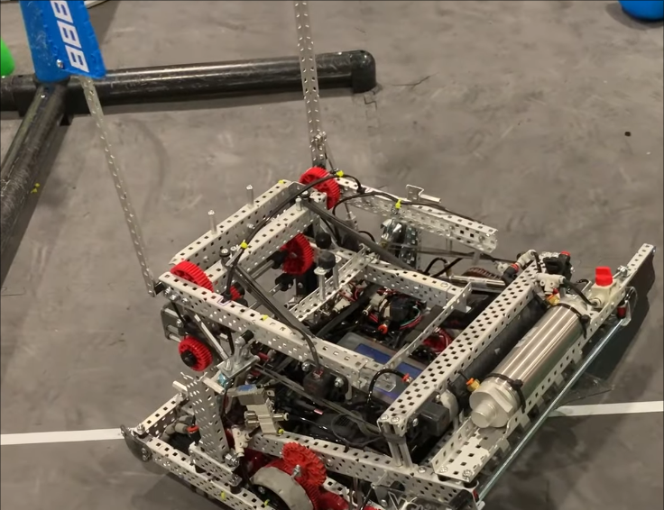|
|24|[5203G](https://youtu.be/lIZKrpuLhwg)|6m, 360prm, 8whl, No Traction|1m, Sprocket Rubber band intake|N/A|1m Puncher|2 horizontal wings/2 vertical wings|4 piston hang mech|Battery and Air tank in drivetrain/Simplicity is key|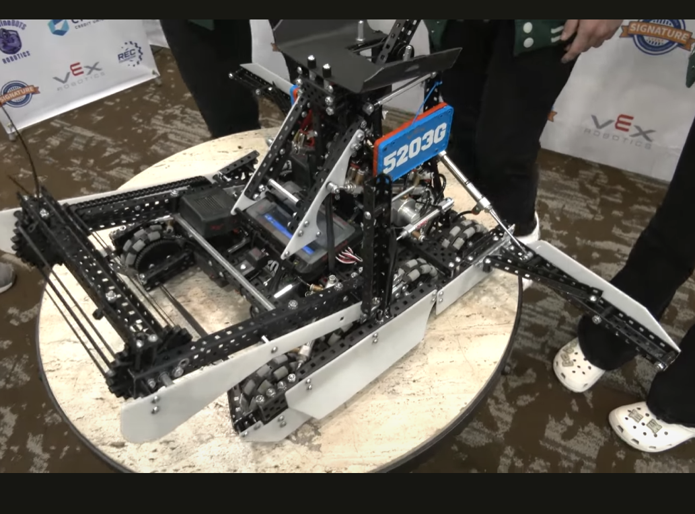|
|25|[9364C](https://youtu.be/q95a-o5AVBo)|4 + 2 0.5m, 400rpm, 6whl, No Traction,|1m, Sprocket Rubber band intake|Launcher lift|1m Puncher, 72:24 Gear Ratio, 33rpm|2 horizontal wings|1 motor lift with adjustable ratchet|Unique 55W drive and no PTOs unlike others with similar design. Also has offset 4 bar.|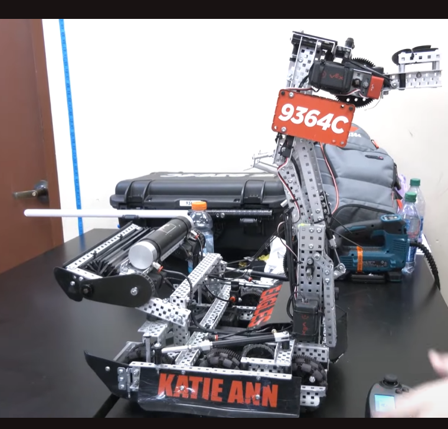|
|30|[100A](https://youtu.be/eUaXNN4vfXM)|6m, 330rpm, 6whl, No traction|1m, 600rpm, Small sprocket rubber bands/High strength|N/A|1m, 60:12 gear ratio, 33rpm Catapult/Puncher|2 horizontal locking wings|2 piston hang mech|Carbon Copy. Uses a small sprocket for intake which is unique.||
|35|[2011A](https://youtu.be/l17H_cC9mws)|6m, 343rpm, 6whl, 4in, raised center whl|1m, Roller intake, 2 bar design|4 piston blocker|1m Cata/Puncher|2 horizontal locking wings|4 piston blocker/hang mech|Integrated blocker/hang mech|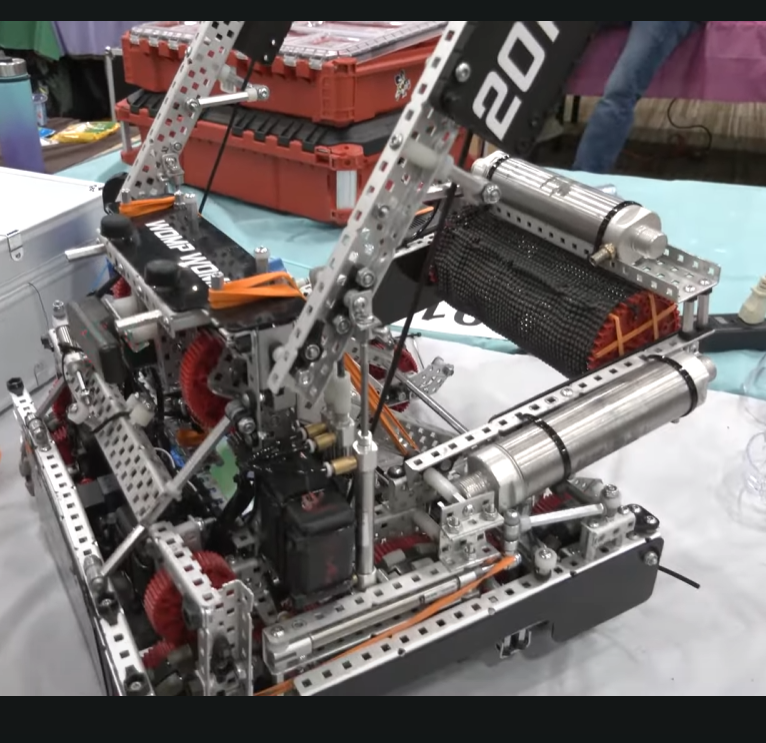|
|38|[96504C](https://youtu.be/_1HvvoY5D3w)|6m, 72:36 gear ratio, 6whl, 4in omnis|1m, Sprocket rubber band, 2 bar|N/A|1.5m Puncher, 133 shots per minute, uses optical sensor|2 horizontal wings|Long Barrier Balance|Use of optical sensor allows for maximum match load efficency|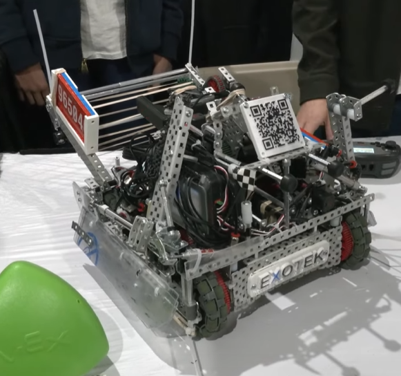|
|40|[80508X](https://youtu.be/j3nqjifhSSU)|8m, 450rpm, 8whl, 2.75in all omnis|4m, Sprocket rubber band, 2 bar|4 piston blocker with 2+2 configuration|4m Cata/Puncher|2 horizontal wings|Long Barrier Balance|2nd bot to use 8m drive with PTO|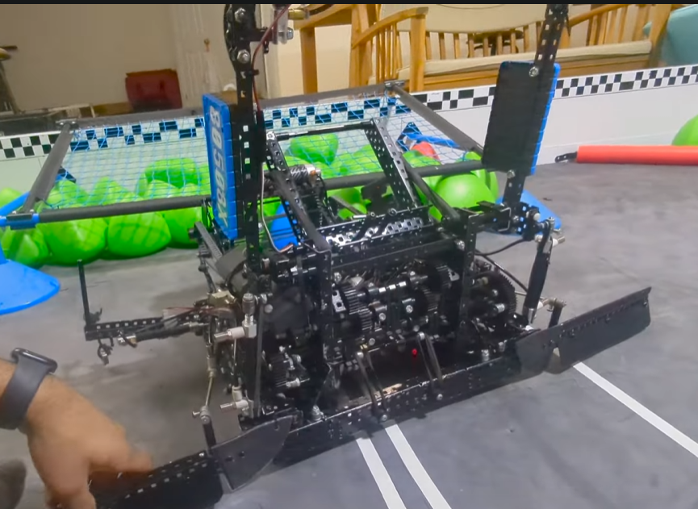|
|41|[338A](https://youtu.be/SUijFCc3Gv4)|6m, 300rpm, all omnis, 4 4in whls, 2 3.25in whls|1m, 600rpm 2in flex wheel intake, 2 bar|2 piston blocker with string|1m Puncher, 100rpm, 36:12 gear ratio, 12t with 6t shaved|2 horizontal wings|A tier Long Barrier Balance|Taller blockers are really important|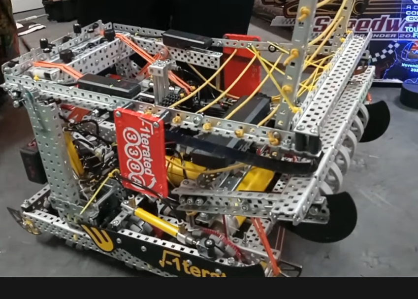|
|51|[11101B](https://youtu.be/dpGNR2CLos8)|6m, 360rpm, 8x3.25in omnis|1m 2in Flex whls|1 piston blocker|1m Cata/Puncher|2 horizontal locking wings|Long Barrier Balance|Carbon Copy. Traction wheels aren't that necessary.|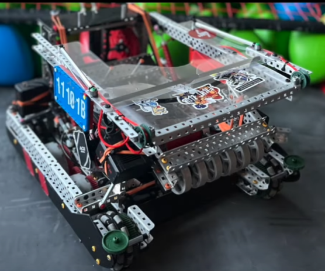|
|52|[8926W](https://youtu.be/pSmulf8pSEA)|6m, 360rpm, 8x3.25in omnis|1m Dual Sprocket Rubberband 4bar|N/A|1m Puncher|2 horizontal wings|Long Barrier Balance|Really like the wing design, I think we could copy this aspect||
|56|[19589A](https://youtu.be/luCByAt2fkk)|6m, 8x3.25 omni|1m, Sprocket Rubber band 2 bar|N/A|1m 25rpm Puncher, 4 bar lift activated by 2 pistons|2 horizontal wings|4 bar lift|Uses a lot of pistons but good starting place.||
